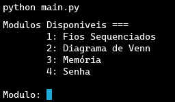

# Keep Talking Helper 🎛️



## Descrição 📝

- Projeto simples em LUA que ajuda a resolver módulos do jogo "Keep Talking and Nobody Explodes" ✅
- Contém auxiliares para: fios sequenciados, diagrama de fio, módulo de memória e senha.

> Simples, offline e interativo.  
> Ideal para usar enquanto uma pessoa descreve o que vê no jogo e outra usa esta ferramenta para ajudar a desarmar.

## Como usar 🚀

1. Execute o programa principal:
   ```bash
   lua main.lua
   ```
2. Escolha o módulo desejado no menu.
3. Siga as instruções interativas.

## Módulos disponíveis 🔧

- 🧵 **Fios Sequenciados** - [`fios_sequenciados`](fios_sequenciados.lua)
- 🔀 **Diagrama de Venn** - [`diagrama_venn`](diagrama_venn.lua)
- 🧠 **Memória** - [`memoria`](memoria.lua)
- 🔤 **Senha** - [`senha`](senha.lua)

## Estrutura do projeto 📁

```
├── main.lua                # 🏠 Menu principal
├── fios_sequenciados.lua   # 🧵 Módulo de fios
├── diagrama_venn.lua       # 🔀 Módulo diagrama
├── memoria.lua             # 🧠 Módulo memória
└── senha.lua               # 🔤 Módulo senha
```

## Contribuições 🤝

- Pull requests são bem-vindos!
- Sugestões de melhorias nos módulos existentes
- Implementação de novos módulos do jogo
